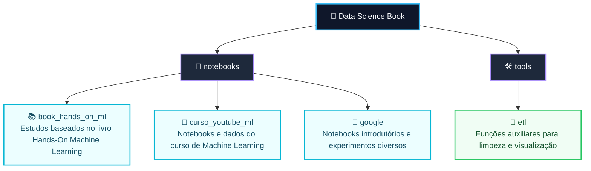

<div align="center">

# Data Science Notes

    ![Matplotlib](https://img.shields.io/badge/Matplotlib-11557C?style=flat&logo=data:image/svg%2bxml;base64,PHN2ZyB4bWxucz0iaHR0cDovL3d3dy53My5vcmcvMjAwMC9zdmciIHZpZXdCb3g9IjAgMCA2NCA2NCI+PGNpcmNsZSBjeD0iMzIiIGN5PSIzMiIgcj0iMzAiIGZpbGw9IndoaXRlIiBzdHJva2U9IiMxMTU1N2MiIHN0cm9rZS13aWR0aD0iNCIvPjxnIHN0cm9rZT0iI2M4YzhjOCIgc3Ryb2tlLXdpZHRoPSIxIiBmaWxsPSJub25lIj48Y2lyY2xlIGN4PSIzMiIgY3k9IjMyIiByPSI5Ii8+PGNpcmNsZSBjeD0iMzIiIGN5PSIzMiIgcj0iMTgiLz48cGF0aCBkPSJNMzIgMnY2ME0yIDMyaDYwTTEwIDEwbDQ0IDQ0TTU0IDEwTDEwIDU0Ii8+PC9nPjxnIHRyYW5zZm9ybT0idHJhbnNsYXRlKDMyIDMyKSI+PHBhdGggZD0iTTAgMEwtMjggM0wtMjUgMTNaIiBmaWxsPSIjZmZkOTY2IiBzdHJva2U9IiMzMzMiLz48cGF0aCBkPSJNMCAwTC03IC0yN0w4IC0zMFoiIGZpbGw9IiNmZjk5NTUiIHN0cm9rZT0iIzMzMyIvPjxwYXRoIGQ9Ik0wIDBMMTYgLTIzTDI1IC0xN1oiIGZpbGw9IiNkNmZmNWMiIHN0cm9rZT0iIzMzMyIvPjxwYXRoIGQ9Ik0wIDBMMjkgMUwyNyA4WiIgZmlsbD0iIzg4YWFmZiIgc3Ryb2tlPSIjMzMzIi8+PHBhdGggZD0iTTAgMEwyMyAyNEwxNiAzMVoiIGZpbGw9IiNmZjk5NTUiIHN0cm9rZT0iIzMzMyIvPjxwYXRoIGQ9Ik0wIDBMMSAyN0wtOSAyNloiIGZpbGw9IiM5OWU2OTkiIHN0cm9rZT0iIzMzMyIvPjxwYXRoIGQ9Ik0wIDBMLTIyIDEzTC0yNSA5WiIgZmlsbD0iIzY2ZDljYyIgc3Ryb2tlPSIjMzMzIi8+PC9nPjwvc3ZnPg==)  

</div>

Este projeto reúne meus estudos práticos sobre Data Science e Machine Learning. A ideia é manter em um só lugar os notebooks, bases de dados de treino, experimentos e funções auxiliares que eu uso para praticar análise de dados, visualização, preparação de datasets e criação de modelos com Python.

## Objetivos

- Documentar meus estudos em Data Science e Machine Learning;
- Organizar notebooks de cursos, livros e experimentos próprios;
- Praticar bibliotecas importantes do ecossistema Python, como pandas, scikit-learn, Matplotlib, NumPy e PyArrow.

## Estrutura



## Conteúdo Atual

- Notebooks com exemplos de classificação, regressão e árvores de decisão;
- Bases de estudo em formatos `.xlsx` e `.parquet`;
- Utilitários em Python para padronização de colunas, tratamento de valores ausentes e gráficos exploratórios.

## Ambiente Sugerido

Crie e ative um ambiente virtual antes de executar os notebooks:

```powershell
python -m venv .venv
.\.venv\Scripts\Activate.ps1
```

Caso esteja usando **Linux**:

```bash
python -m venv .venv
source .venv/bin/activate
```

Instale as bibliotecas usadas nos estudos conforme a necessidade dos notebooks:

```powershell
python -m pip install pandas scikit-learn matplotlib numpy pyarrow openpyxl ipykernel
```

Depois disso, selecione o kernel da `.venv` no Jupyter ou no VS Code para executar os notebooks com o ambiente correto.

## Licenças

O código autoral deste projeto está licenciado sob a MIT License. As anotações,
explicações e materiais didáticos autorais estão licenciados sob Creative
Commons Attribution-NonCommercial-ShareAlike 4.0 International
(CC BY-NC-SA 4.0).

Materiais de terceiros, incluindo datasets, cursos, livros, exemplos e
documentações externas, pertencem aos seus respectivos autores e seguem suas
próprias licenças ou termos de uso. Consulte [LICENSE.txt](LICENSE.txt) e
[THIRD_PARTY_NOTICES.md](THIRD_PARTY_NOTICES.md) para detalhes.
